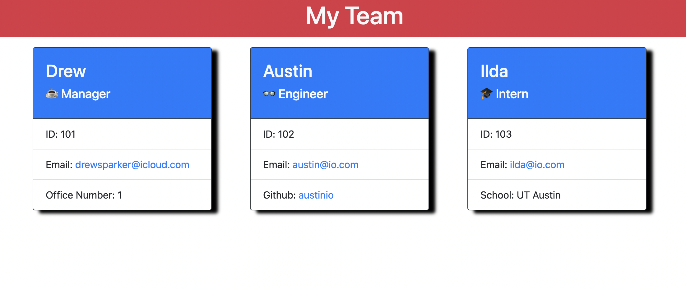

  <h1 align="center">Team Profile Generator</h1>

  ## Description
  This app was designed to generate a multi-person team profile based on employee position in the company utilizing the Inquirer Modeule from node.js. Once the prompts have been ran through the app will produce a HTML page. This app also utilized OOP and Jest for testing.
    
  The README.md file is created in the directory and can be found [here](./README.md).
  
  Here is a link to the 
  [video](https://drive.google.com/file/d/154KTPdfQ5lpmh373PRzWDAYba-Io05SJ/preview).

  ## Table of Contents
  - [Installation](#installation)
  - [Usage](#usage)
  - [License](#license)
  - [Test](#test)
  - [Questions](#questions)

  ## Installation
  Begin by cloning the GitHub repository and installing Node. Utilize Jest for testing. You will also need the inquirer system and an organized file system.

  ## Usage
  Use Inquirer from command line prompts to generate employee cards.

  

  ## License
  
  
  [MIT](https://opensource.org/licenses/MIT)

  ## Contributors
  n/a

  ## Test
  To test the code, run `npm test` to run Jest for tests on constructors.

  ## Questions
  If you have any qurstions about this app usage or would like to see something added, please contact me.

   
✉️ Email me with any questions: drewsparker@icloud.com 